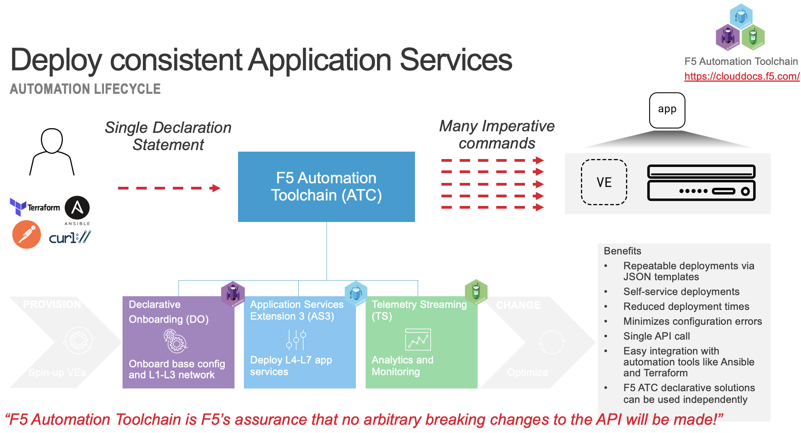
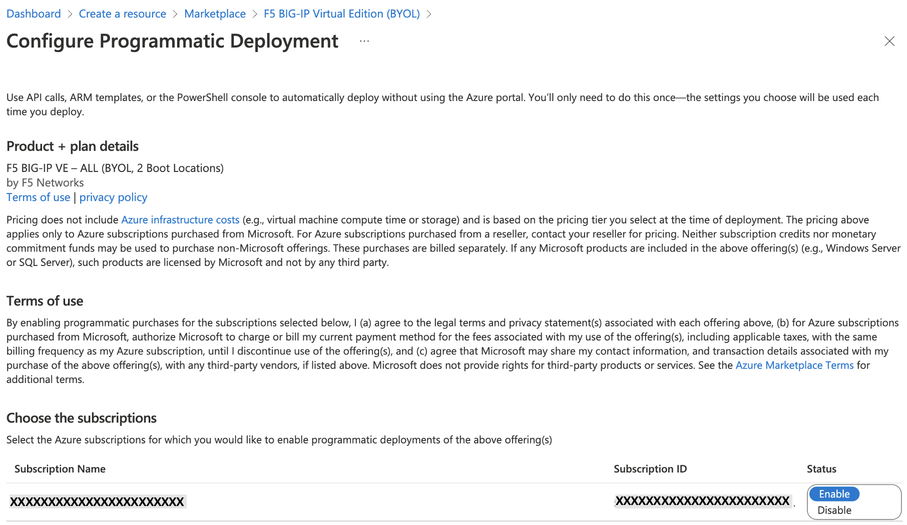
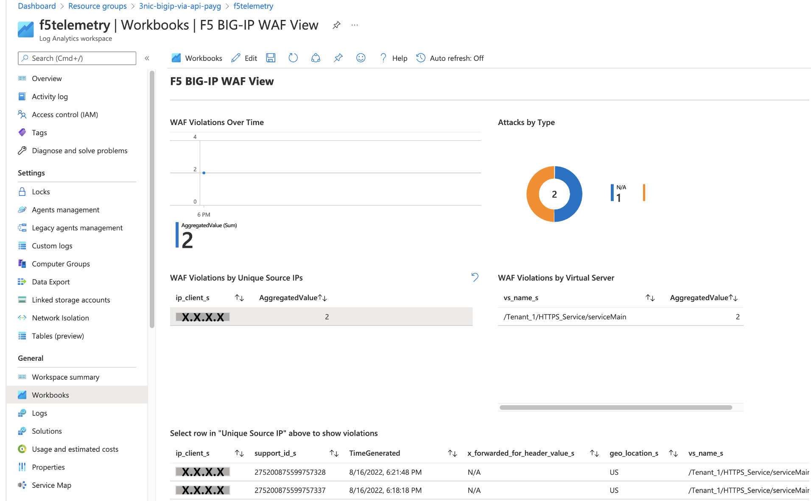

# Azure Quick Starts

**This is a community based project. As such, F5 does not provide any offical support for this project**

## Introduction
This repo includes several scripts to deploy F5 BIG-IP solutions into **Azure** by either selecting PAYG or the BIG-IQ section. 

F5 BIG-IP solution designs are:
- standalone;
- failover via-api;
- failover-lb;
- auto-scale.

Each deployment uses **Terraform** to launch one or more BIG-IP('s) with 1-nic or 3-nics.

When you are not familar with these F5 BIG-IP designs in public cloud, please check out the F5 Cloud Solution Templates on Github: https://github.com/F5Networks/f5-azure-arm-templates-v2.

## What to expect

Each pre-crafted design can be used to deploy F5 BIG-IP which than will get provisioned into Azure public cloud.
The following will happen:

* A full deployment of BIG-IP will get configured in Azure, including network, storage, VMs, backend webservers with an basic application.
* BIG-IP will get deployed with LTM and WAF fully functioning.
* BIG-IP uses [runtime-init](https://github.com/F5Networks/f5-bigip-runtime-init) and leverages it as a startup config (cloud-init) to download and install [F5 Automation Tool Chain](https://clouddocs.f5.com/) packages and deploys them so these ATC functions can be leveraged during and after the deployment.

## How to use

**Note:**
When selecting the 'big-iq' developed F5 BIG-IP designs, please be aware that this repo does not provide you with a BIG-IQ License Manager.

1. Clone the Azure quick start collection and include it into your own before deploying.

2. Once cloned, make sure Terraform and Azure CLI are installed on the system from where you want to start   using the cloned repo.

 
     **WARNING:**
     Make sure that you have 'Enabled' the BIG-IP Plan at Azure Marketplace by subscribing the 'Terms of Use' before deploying.
  
  

3. Copy tfvars.tf.example to tfvars.tf and modify it to your personal needs.

4. From a Shell, deploy the selected BIG-IP design by typing the following in the selected script folder:

   **terraform init**

   **terraform plan**

   **terraform apply -auto-approve**

   When Terraform is done it generates useful output.

5. Complete deployment of the BIG-IPs using runtime, including the backends, can take around 10 - 15 mins.

## Once Deployed
Login to the BIG-IPs and explore how everything has been deployed and configured by only doing a 'Terraform apply'. When deploying a cluster with via-api check if both BIG-IPs are synced.

Check if the application is up and running and test it by using the VIP public IP. This will be associated by Azure with the BIG-IP VIPs private IP. 

At the Azure portal go to the created resource group and select **f5telemetry > workbooks > F5 BIG-IP WAF View** to check the deployed graphs. You will notice that at this point it might take time before the Application availability graphs will show some results.

For the WAF section of the graphs we first need to generate some 'negative' traffic.

**curl -sk -X DELETE https://(vip-pub-ip-address)** (repeat this a couple of times)

After 5 - 10 minutes you will see the graphs section turn from 'red' error into 'blue' this indicates that the graphs will get intiated and within a couple of refreshes you will see WAF graphs showing up.

Meanwhile you can check at the BIG-IP in the security section if the Application Securiy Policy is getting hit.

Once the log data has reached **F5 BIG-IP WAF View** you should have the same kind of view as below.

 

## Removing the Deployment

Removing the BIG-IP design can be done by:
- via Terraform by destroying the deployment

**terraform destroy -auto-approve**

or:
- delete the Azure Resource Group in the portal.

## Next Step
When you deployed an F5 BIG-IP via Terraform and like to know more you can check out this workshop: https://github.com/gwolfis/cloud-automation-workshop
 
